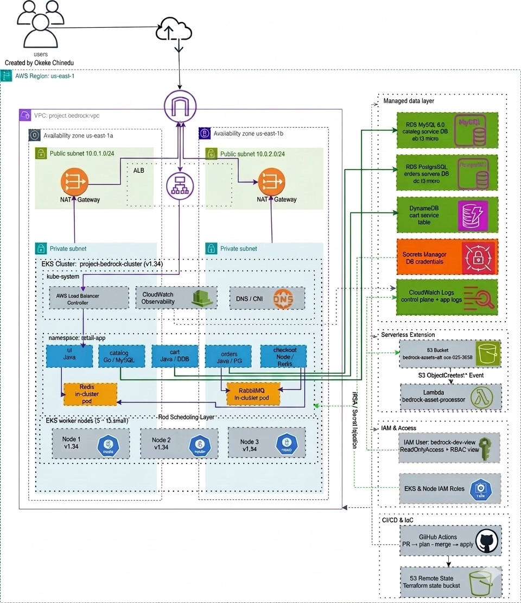

# Project Bedrock Deployment Guide

This repository contains a customized deployment of the AWS Containers Retail Store Sample App for InnovateMart's Project Bedrock assessment. The original sample application remains in `src/`, while the project-specific AWS infrastructure, Kubernetes deployment, CI/CD workflow, and grading outputs live under `infrastructure/`, `.github/`, and `grading.json`.

The goal of this implementation is to provision a production-style Amazon EKS environment in `us-east-1`, deploy the retail microservices into the `retail-app` namespace, replace selected in-cluster data stores with managed AWS services, enable observability, provide restricted developer access, and add an S3-to-Lambda event-driven extension.

## Repository Map

| Path | Purpose |
| --- | --- |
| `infrastructure/terraform/` | Root Terraform stack for Project Bedrock. Creates AWS infrastructure, Kubernetes resources, Helm releases, and serverless resources. |
| `infrastructure/terraform/modules/vpc/` | VPC, subnets, route tables, internet gateway, NAT gateway, and EKS subnet tags. |
| `infrastructure/terraform/modules/eks/` | EKS cluster, managed node group, IAM roles, OIDC provider, CloudWatch Observability add-on, and AWS Load Balancer Controller IAM role. |
| `infrastructure/terraform/modules/rds/` | Amazon RDS MySQL and PostgreSQL instances, RDS security group, subnet group, and Secrets Manager entries. |
| `infrastructure/terraform/modules/dynamodb/` | DynamoDB table used by the cart service. |
| `infrastructure/terraform/modules/iam/` | Restricted developer IAM user `bedrock-dev-view`, console login profile, access key, read-only policy attachment, S3 upload policy, and stored credentials secret. |
| `infrastructure/terraform/modules/s3-lambda/` | Private S3 assets bucket, Lambda processor, S3 event notification, and Lambda permissions. |
| `infrastructure/helm/` | Additional values files for Helm-based service deployment. |
| `src/*/chart/` | Helm charts for the retail application services. |
| `.github/workflows/terraform.yml` | GitHub Actions workflow for Terraform plan on pull request and apply on merge to `main`. |
| `grading.json` | Root-level Terraform output JSON used by the grading process. |

## Fixed Project Requirements

The implementation follows the assessment naming and region constraints below.

| Requirement | Value |
| --- | --- |
| AWS Region | `us-east-1` |
| EKS Cluster | `project-bedrock-cluster` |
| VPC Name Tag | `project-bedrock-vpc` |
| Kubernetes Namespace | `retail-app` |
| Developer IAM User | `bedrock-dev-view` |
| Assets S3 Bucket | `bedrock-assets-alt-soe-025-5329` |
| Lambda Function | `bedrock-asset-processor` |
| Default Resource Tag | `Project = karatu-2025-capstone` |
| Terraform Root | `infrastructure/terraform` |

## Architecture Overview

The deployment is split into five major layers:

1. **Networking**: Terraform creates a dedicated VPC with public and private subnets across two Availability Zones. Public subnets support internet-facing load balancing, while private subnets host EKS worker nodes and RDS databases.
2. **Compute and Kubernetes**: Terraform provisions an EKS cluster named `project-bedrock-cluster` with a managed node group. The retail application is deployed with Helm into the `retail-app` namespace.
3. **Managed Data Layer**: The default in-cluster MySQL, PostgreSQL, and DynamoDB behavior is overridden. Catalog uses Amazon RDS MySQL, Orders uses Amazon RDS PostgreSQL, and Cart uses Amazon DynamoDB.
4. **Ingress and Observability**: The AWS Load Balancer Controller creates an internet-facing ALB from the Terraform-managed Kubernetes Ingress. EKS control plane logs and the Amazon CloudWatch Observability add-on provide logging coverage.
5. **Serverless Extension**: A private S3 bucket receives product assets and triggers a Lambda function that logs uploaded object details to CloudWatch Logs.


## Terraform Stack

The root Terraform stack is in `infrastructure/terraform`.

Important files:

- `backend.tf` configures remote state in S3.
- `providers.tf` configures AWS, Kubernetes, and Helm providers.
- `variables.tf` defines naming, region, credentials, and node sizing inputs.
- `main.tf` wires modules together and deploys Kubernetes/Helm resources.
- `outputs.tf` exposes required grading outputs.

Required root outputs:

- `cluster_endpoint`
- `cluster_name`
- `region`
- `vpc_id`
- `assets_bucket_name`

Additional useful outputs include:

- `cart_role_arn`
- `app_url`

## Remote State

Terraform uses an S3 backend:

```hcl
bucket = "project-bedrock-tfstate-alt-soe-025-5329"
key    = "project-bedrock/terraform.tfstate"
region = "us-east-1"
```

The backend bucket must exist before `terraform init` can complete. The bucket is not created or destroyed by this stack because Terraform backends are initialized before Terraform can manage resources.

## Prerequisites

Install and configure:

- AWS CLI
- Terraform
- kubectl
- Helm
- GitHub repository secrets for CI/CD

AWS credentials must be able to create and manage:

- VPC, subnets, route tables, NAT gateway, internet gateway, security groups, and EIPs
- EKS clusters, node groups, add-ons, and access entries
- IAM users, roles, policies, access keys, and OIDC providers
- RDS instances and subnet groups
- DynamoDB tables
- S3 buckets and bucket notifications
- Lambda functions and permissions
- CloudWatch logs

## Local Deployment

From the Terraform root:

```powershell
cd C:\Sch.Cl\KRI_CAP\retail-store-sample-app\infrastructure\terraform
terraform init
terraform validate
terraform plan
terraform apply
```

Do not commit plaintext secrets. Provide database credentials through environment variables or a local ignored `terraform.tfvars` file:

```powershell
$env:TF_VAR_db_username = "adminuser"
$env:TF_VAR_db_password = "<secure-password>"
terraform apply
```

After apply, configure kubectl:

```powershell
aws eks update-kubeconfig --name project-bedrock-cluster --region us-east-1
kubectl get pods -n retail-app
```

Get the application URL:

```powershell
terraform output app_url
```

If the output says the ALB is still provisioning, wait a few minutes and run the command again.

## CI/CD Pipeline

The workflow file is `.github/workflows/terraform.yml`.

Pipeline behavior:

- Pull requests that change `infrastructure/terraform/**` run `terraform plan`.
- The plan output is posted as a pull request comment.
- Pushes to `main` that change `infrastructure/terraform/**` run `terraform apply -auto-approve`.
- AWS authentication uses GitHub OIDC through the `AWS_ROLE_ARN` repository secret.

Required GitHub secrets:

| Secret | Purpose |
| --- | --- |
| `AWS_ROLE_ARN` | IAM role assumed by GitHub Actions through OIDC. |
| `TF_VAR_DB_USERNAME` | RDS master username used during Terraform runs. |
| `TF_VAR_DB_PASSWORD` | RDS master password used during Terraform runs. |

The workflow also attempts to bootstrap the CI role into EKS access entries so Terraform can manage Kubernetes and Helm resources after the cluster exists.

## Application Deployment Details

Terraform deploys the application with Helm releases:

- `catalog`
- `cart`
- `orders`
- `checkout`
- `ui`
- `aws-load-balancer-controller`

The application namespace is created by Terraform:

```text
retail-app
```

The ingress resource is:

```text
retail-store-ingress
```

Ingress annotations request an internet-facing AWS ALB using the AWS Load Balancer Controller.

## Data Layer

The default chart data stores are changed as follows:

| Service | Backing Store | Implementation |
| --- | --- | --- |
| Catalog | MySQL | Amazon RDS MySQL in private subnets. |
| Orders | PostgreSQL | Amazon RDS PostgreSQL in private subnets. |
| Cart | DynamoDB | Amazon DynamoDB table `retailstore-cart`. |
| Orders messaging | RabbitMQ | In-cluster RabbitMQ pod. |
| Checkout cache | Redis | In-cluster Redis from the checkout chart values. |

Database credentials are stored in AWS Secrets Manager and also projected into Kubernetes secrets used by the Helm releases.

## Security Model

The project creates a restricted developer user:

```text
bedrock-dev-view
```

This user has:

- AWS `ReadOnlyAccess` for console visibility.
- A custom policy allowing `s3:PutObject` to the project assets bucket.
- EKS access policy association with `AmazonEKSViewPolicy`.
- Kubernetes RBAC binding to the built-in `view` ClusterRole.

Expected behavior:

```powershell
kubectl get pods -n retail-app
```

should succeed for the developer user, while destructive commands such as:

```powershell
kubectl delete pod <pod-name> -n retail-app
```

should fail.

Developer credentials are written to Secrets Manager by Terraform. Retrieve and share them only through the approved grading/submission channel.

## Observability

Observability is configured in two places:

- EKS control plane logging is enabled for API, audit, authenticator, controller manager, and scheduler logs.
- The Amazon CloudWatch Observability EKS add-on is installed after the managed node group is created.

Use CloudWatch Logs to inspect:

- EKS control plane logs.
- Retail application container logs.
- Lambda invocation logs for asset uploads.

## S3 and Lambda Extension

The serverless extension includes:

- Private bucket: `bedrock-assets-alt-soe-025-5329`
- Lambda function: `bedrock-asset-processor`
- Trigger: S3 object-created event notification

The Lambda code is in:

```text
infrastructure/terraform/modules/s3-lambda/lambda/handler.py
```

To test the extension:

```powershell
aws s3 cp .\sample-image.txt s3://bedrock-assets-alt-soe-025-5329/sample-image.txt --region us-east-1
```

Then check the Lambda function logs in CloudWatch Logs for an upload message.

## Grading Output

The assessment requires a committed root-level `grading.json` generated from Terraform outputs.

After a successful apply, run from `infrastructure/terraform`:

```powershell
terraform output -json > ..\..\grading.json
```

The file should include at least:

- `cluster_endpoint`
- `cluster_name`
- `region`
- `vpc_id`
- `assets_bucket_name`

## Verification Checklist

Use this checklist before submission:

- `terraform validate` passes.
- `terraform output cluster_name` returns `project-bedrock-cluster`.
- `terraform output region` returns `us-east-1`.
- `terraform output assets_bucket_name` returns `bedrock-assets-alt-soe-025-5329`.
- `kubectl get ns retail-app` succeeds.
- `kubectl get pods -n retail-app` shows the retail services running.
- `kubectl get ingress -n retail-app` shows `retail-store-ingress`.
- `terraform output app_url` returns the ALB URL.
- The UI is reachable through the ALB URL.
- RDS MySQL and PostgreSQL exist in private subnets.
- DynamoDB table `retailstore-cart` exists.
- CloudWatch has EKS control plane and workload logs.
- Uploading an object to the assets bucket invokes `bedrock-asset-processor`.
- The `bedrock-dev-view` user can view resources but cannot delete Kubernetes pods.
- Root `grading.json` has been regenerated and committed.

## Cleanup and Cost Control

EKS clusters, worker nodes, RDS instances, NAT gateways, ALBs, and other resources can incur ongoing charges. Destroy the environment when it is not needed.

Recommended cleanup order:

```powershell
cd C:\Sch.Cl\KRI_CAP\retail-store-sample-app\infrastructure\terraform
aws eks update-kubeconfig --name project-bedrock-cluster --region us-east-1
kubectl delete ingress retail-store-ingress -n retail-app --ignore-not-found=true --wait=true
terraform plan -destroy -out=destroy.tfplan
terraform apply destroy.tfplan
```

After destroy, verify that no project resources remain:

```powershell
aws eks describe-cluster --name project-bedrock-cluster --region us-east-1
aws rds describe-db-instances --region us-east-1
aws dynamodb describe-table --table-name retailstore-cart --region us-east-1
aws lambda get-function --function-name bedrock-asset-processor --region us-east-1
aws s3 ls s3://bedrock-assets-alt-soe-025-5329
aws elbv2 describe-load-balancers --region us-east-1
```

The remote Terraform state bucket is intentionally separate from the managed stack. Keep it if you plan to redeploy later with the same state history. Delete it only after the Terraform-managed resources are fully destroyed and you no longer need the state:

```powershell
aws s3 rm s3://project-bedrock-tfstate-alt-soe-025-5329 --recursive
aws s3 rb s3://project-bedrock-tfstate-alt-soe-025-5329
```

## Important Notes

- Do not commit `terraform.tfvars`, access keys, database passwords, or generated secret material.
- Keep the EKS cluster reachable until Terraform has removed Kubernetes and Helm resources.
- If Kubernetes access is lost during destroy, restore EKS access entries for the current AWS principal before retrying.
- If Helm releases were manually removed, use `terraform state rm` only after verifying the releases no longer exist in the cluster.
- Review `terraform plan` carefully before merging changes to `main`; the CI workflow applies real AWS changes.
